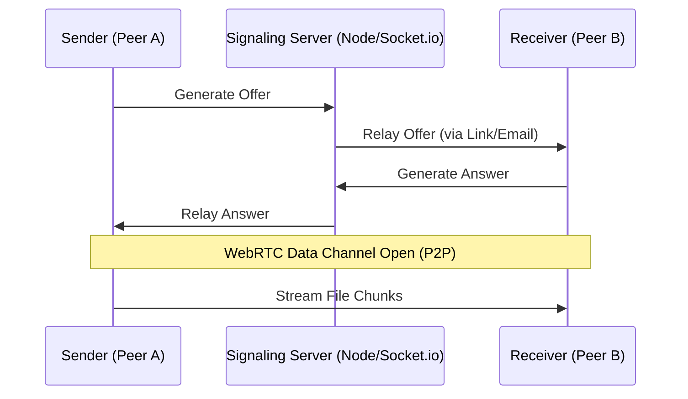

# SecureTransfer (SDR-9)

**SecureTransfer** is a high-performance, real-time file-sharing system built on the WebRTC protocol. It enables fully peer-to-peer (P2P) transfers, ensuring your files never touch a central server.

---

### System Architecture

SecureTransfer uses a **Signaling-First, P2P-Second** approach. While the server helps peers find each other, it never sees the file data.

### Connection Flow

---

##  Demo Video

> https://github.com/user-attachments/assets/3ec9cbf1-c4ae-4a61-aed0-545f4fbbe6a4


---

## System Architecture

SecureTransfer relies on **WebRTC Data Channels** to facilitate direct communication between browsers.

### How it Works
1. **The Handshake:** The **Sender** creates a room, which generates a unique WebRTC "Offer."
2. **Signaling:** The **Receiver** joins via a shared link or email invitation. We use a Socket.io signaling server to exchange connection metadata.
3. **The Connection:** Once the peers find each other via STUN servers, the connection becomes purely P2P. 
    * *Note:* Success rates for STUN-based connections are typically around 80%. If a connection fails, it is usually due to restrictive firewalls (Symmetric NAT), not the software itself.
4. **The Transfer:** Files are broken into small chunks, sent over the data channel, and reassembled in real-time on the receiver's end.

### The "Hard Part": Chunking & Assembly
Handling files over 1GB without crashing the browser was the primary challenge. 
* **Memory Management:** To avoid memory overflow, we don't load the whole file at once. We slice the file into `ArrayBuffer` chunks.
* **Reassembly:** On the receiver side, we manage `Uint8Array` fragments, ensuring they are reassembled in the correct order to maintain file integrity.

---

## Tech Stack

* **Frontend:** React (UI & WebRTC implementation)
* **Signaling Server:** Node.js (Express & Socket.io)
* **Email Queue:** BullMQ + Redis (Handles invitation delivery)
* **UI Design:** Gemini AI

---

##  Installation & Setup

### 1. Prerequisites
* Node.js installed
* Redis server running (for BullMQ)

### 2. Backend Setup
```bash
cd backend
npm install
# Configure your .env file (see .env.example)
npm run dev

```

### 3. Run the Worker (For Email Invitations)

```bash
cd backend
npm run worker

```

### 4. Frontend Setup

```bash
cd frontend
npm install
npm run dev

```

---

Love it! Give it a star.